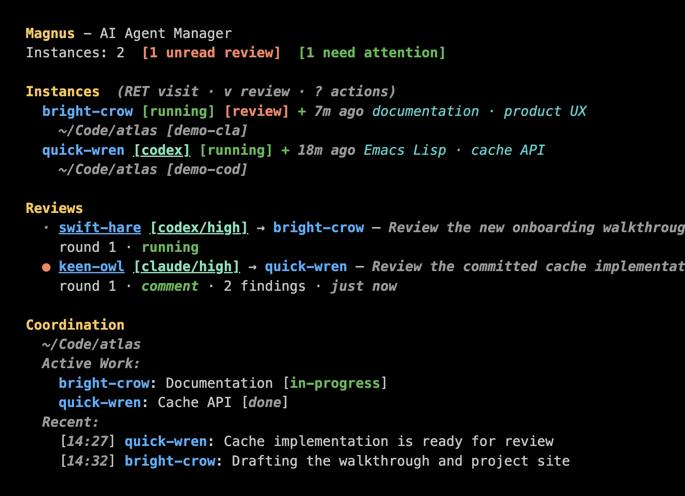
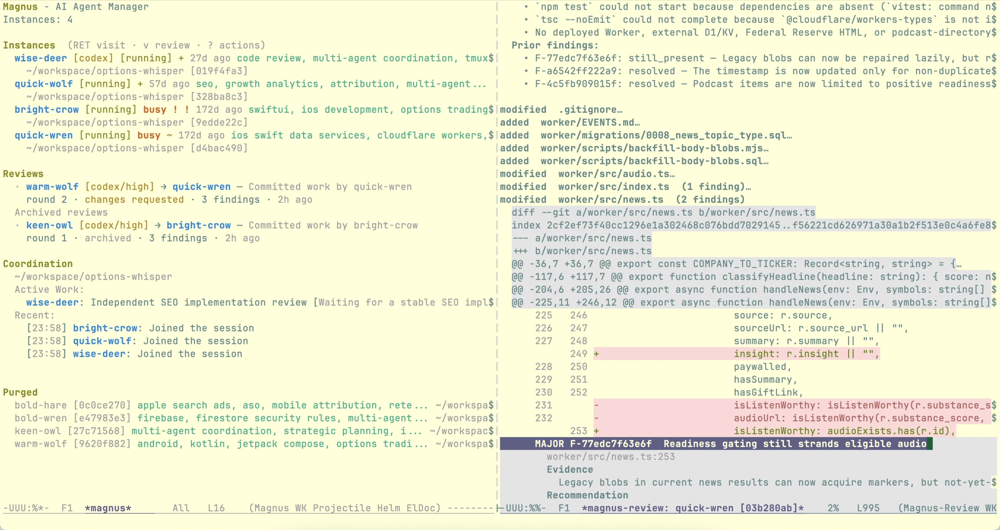

# Magnus

[](https://melpa.org/#/magnus)
[](https://github.com/hrishikeshs/magnus/actions/workflows/ci.yml)

A magit-inspired interface for managing Claude Code and Codex agents within Emacs.

Run multiple AI agents in parallel, let them communicate to avoid conflicts,
and handle their permission requests one at a time.

[Website](https://hrishikeshs.github.io/magnus/) ·
[Getting started](docs/getting-started.md) ·
[Command reference](docs/reference.md) ·
[Architecture](docs/architecture.md)

## Screenshot

**Named agents, active work, attention, and coordination in one buffer:**



## Why Magnus?

When working with Claude Code, you often want multiple agents working simultaneously:
- One agent refactoring the auth module
- Another writing tests
- A third updating documentation

But this creates problems:
- **File conflicts**: Agents might edit the same files
- **Context sharing**: How do agents know what others are doing?
- **Permission chaos**: Multiple agents asking for input at once
- How to get a different model to review the work produced by a given model?

Magnus solves all of this.

## Features

### Native Claude Code and Codex agents

Each agent runs in its provider's full native TUI inside a `vterm` buffer.
Streaming output, approval prompts, slash commands, and the terminal composer
keep working as they do outside Emacs. Magnus adds orchestration around those
interfaces instead of replacing them with another chat UI.

### Instance Management

Create, visit, steer, rename, archive, and resurrect named agents such as
`swift-fox` and `keen-owl`. Each agent has its own terminal and working
directory. Magnus preserves provider sessions when they are available, so an
archived collaborator can return with its conversation intact.

### Agent Coordination

Agents communicate through a shared `.magnus-coord.md` file:

```markdown
## Active Work
| Agent | Area | Status | Files |
|-------|------|--------|-------|
| swift-fox | auth module | in-progress | src/auth.ts |
| keen-owl | api tests | in-progress | tests/api/*.test.ts |

## Discoveries
- The user API returns 404 for deleted users — handle both cases (swift-fox)

## Log
[10:30] swift-fox: Starting auth work. I will touch src/auth.ts.
[10:31] keen-owl: Got it. I will stay in tests/api/.
```

Agents are instructed to check in, declare what they are changing, share
discoveries, and notify one another with `@name` mentions. Magnus keeps the
journal lean and surfaces its activity in the status buffer.

This is advisory coordination — agents are instructed to follow the protocol, and Claude is good at it.
Codex receives equivalent provider-neutral instructions.

### Attention, health, and steering

- Press `m` in the status buffer to send an agent a message.
- Agents waiting for permission or input enter one attention queue; press `a`
  to visit the next one.
- Health symbols show which terminals are active, stale, stuck, or dead.
- Common safe operations can be auto-approved with a customizable allowlist.

Magnus is built for a programmer who wants to remain in the loop: keep two
agents side by side, move between their native terminals, and redirect them as
the work evolves.

### Shared knowledge and context

Each project can have a shared scratch buffer for notes, links, tickets, and
other source material. Agent memories and coordination discoveries survive
individual sessions. Press `t` to follow a provider's recorded trace: Claude
thinking blocks where available, or Codex's visible engineering journals and
messages—not encrypted internal reasoning.

For self-contained jobs, Magnus can also run fire-and-forget Claude tasks as
headless background processes. Interactive agents remain the main workflow.

### Independent cross-provider review

When an agent finishes a committed unit of work, put point on it in `*magnus*`
and press `v RET`. Magnus asks the author for the exact commits, chooses a
reviewer using its existing expertise matching, and uses the opposite provider
by default. Uncommitted work is rejected with a prompt to ask the author to
commit first.

The result opens as a folding, Magit-style diff with findings anchored to the
reviewed snapshot. Follow-up rounds retain the reviewer's identity and session,
so author and reviewer can continue until the findings are resolved.



See [Independent reviews](docs/reviews.md) for the review lifecycle, reader
commands, and evidence guarantees.

## Requirements

- Emacs 28.1 or newer
- [vterm](https://github.com/akermu/emacs-libvterm) 0.0.2 or newer
- [transient](https://github.com/magit/transient) 0.4.0 or newer
- [magit-section](https://github.com/magit/magit) 3.3.0 or newer
- [Claude Code](https://docs.anthropic.com/en/docs/claude-code),
  [Codex CLI](https://github.com/openai/codex), or both

Install and authenticate each provider CLI before launching it through Magnus.
Only the CLI you use is required; install both for the default cross-provider
review workflow.

## Installation

Magnus is available from MELPA:

```elisp
(use-package magnus
  :ensure t
  :bind (("C-c m" . magnus)
         ("C-c M" . magnus-create-instance)))
```

Or run `M-x package-install RET magnus RET`.

See [Getting started](docs/getting-started.md) for `package-vc`, `straight.el`,
and `quelpa` installation, provider setup, and `M-x magnus-doctor`.

## Quick start

1. Run `M-x magnus`.
2. Press `c` for Claude Code, or press `?` and then `X` for Codex.
3. Choose a Git project and work in the native TUI that opens.
4. Return to `*magnus*` and create another agent when the work benefits from a
   second pair of hands.
5. Use `RET` to visit an agent, `m` to steer it, and `a` to handle the next
   agent that needs attention.

Press `?` in `*magnus*` for the complete dispatcher. The minibuffer shows
contextual actions as point moves. In an agent terminal, `C-g` sends Escape to
the provider TUI because Emacs normally reserves `ESC` as a Meta prefix.

## Documentation

- [Getting started](docs/getting-started.md) — installation, authentication,
  first agents, Doctor, and provider capabilities
- [Command reference](docs/reference.md) — status keys, traces, attention,
  health, shared context, persistence, and customization
- [Independent reviews](docs/reviews.md) — committed scope, multi-round
  lineages, reader commands, failures, and retries
- [Architecture](docs/architecture.md) — terminals, identity, coordination,
  process ownership, review evidence, and resource bounds
- [Troubleshooting](docs/troubleshooting.md) — common setup and runtime problems
- [Release notes](NEWS.md)

## Development

```sh
make test
make lint
```

## License

MIT
