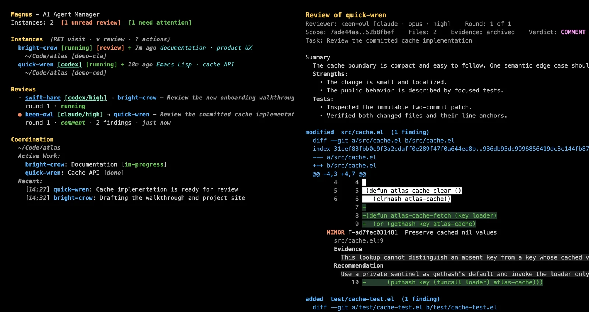

# Magnus

[](https://melpa.org/#/magnus)
[](https://github.com/hrishikeshs/magnus/actions/workflows/ci.yml)

**Claude Code and Codex, under one Emacs roof.**

Magnus is a Magit-inspired control room for hands-on work with AI coding
agents. It keeps each agent's native terminal UI, then adds the parts terminal
tabs cannot provide: durable identities, a shared coordination journal,
attention and health signals, and independent cross-provider review over exact
committed Git evidence.

[Website](https://hrishikeshs.github.io/magnus/) ·
[Getting started](docs/getting-started.md) ·
[Independent reviews](docs/reviews.md) ·
[Command reference](docs/reference.md) ·
[Architecture](docs/architecture.md)



*The team on the left; exact committed evidence and its independent review on
the right.*

## Why Magnus?

One agent is a terminal. Two agents are a system.

Once several sessions share a project, the hard questions move above the
prompt: Who owns what? Which agent needs input? What survives until tomorrow?
How do you ask a fresh model to review the work without rebuilding all of its
context by hand?

Magnus makes that system visible while keeping the programmer in charge:

- run Claude Code and Codex side by side in native `vterm` buffers;
- name, visit, steer, archive, and resurrect persistent collaborators;
- see active work, attention, health, and reviews in one `*magnus*` buffer;
- let agents coordinate through a readable project journal;
- send committed work to the other provider for an independent review;
- read anchored findings in a folding Magit-style diff;
- continue with the same reviewer identity across follow-up rounds.

Magit does not replace Git. Magnus does not replace Claude Code or Codex. It
makes their native tools feel at home in Emacs.

## The workflow

1. Create a Claude agent with `c`, or a Codex agent with `? X`.
2. Work directly in the provider's normal terminal UI. Approval prompts, slash
   commands, streaming output, and terminal composers remain intact.
3. Create another named agent when the work benefits from a second pair of
   hands. Magnus gives the team shared onboarding and coordination.
4. Commit the completed work, put point on its author in `*magnus*`, and press
   `v RET`.
5. Magnus asks the author which commits belong to the task, runs a fresh
   headless reviewer, and publishes only a successful structured result.
6. Open the review row to inspect findings against the immutable diff. Ask for
   another round after the author addresses them.

Magnus is designed for this supervised two-or-three-agent sweet spot. It is not
an unattended swarm or a replacement chat interface.

## What is included

| Capability | Claude Code | Codex |
|------------|-------------|-------|
| Native interactive `vterm` UI | yes | yes |
| Durable identity, archive, and resurrection | yes | yes |
| Shared coordination, attention, and health | yes | yes |
| Local provider trace viewer | yes | visible records only |
| Author or independent reviewer | yes | yes |
| Live process suspend and resume | yes | no |
| User-invoked fire-and-forget headless task | yes | no |

The review engine itself is provider-neutral. With both CLIs installed, Magnus
defaults to a reviewer from the provider opposite the author.

## Requirements

- Emacs 28.1 or newer. CI covers Emacs 28.1, 29.4, and 30.2.
- [vterm](https://github.com/akermu/emacs-libvterm) 0.0.2 or newer.
- [transient](https://github.com/magit/transient) 0.4.0 or newer.
- [magit-section](https://github.com/magit/magit) 3.3.0 or newer.
- Git for review evidence and navigation.
- [Claude Code](https://docs.anthropic.com/en/docs/claude-code),
  [Codex CLI](https://github.com/openai/codex), or both.

Install and authenticate each provider CLI before launching it through Magnus.
Only the CLI for the provider you use is required; install both for the default
cross-provider review workflow.

## Install from MELPA

```elisp
(use-package magnus
  :ensure t
  :bind (("C-c m" . magnus)
         ("C-c M" . magnus-create-instance)))
```

Or run `M-x package-install RET magnus RET`.

After installation:

1. If this Emacs session already loaded another Magnus version, restart it.
2. Run `M-x magnus-doctor` to verify libraries, provider CLIs, Git, and storage.
3. Run `M-x magnus`.

<details>
<summary>Other installation methods</summary>

### package-vc (Emacs 29+)

```text
M-x package-vc-install RET https://github.com/hrishikeshs/magnus RET
```

```elisp
(unless (package-installed-p 'magnus)
  (package-vc-install "https://github.com/hrishikeshs/magnus"))
```

### straight.el

```elisp
(straight-use-package
 '(magnus :type git :host github :repo "hrishikeshs/magnus"))
```

### quelpa

```elisp
(quelpa '(magnus :fetcher github :repo "hrishikeshs/magnus"))
```

</details>

`M-x magnus-upgrade` performs a guarded package reinstall and asks for the same
restart.

## A 60-second start

1. Run `M-x magnus`.
2. Press `c` for Claude Code, or press `?` and then `X` for Codex.
3. Choose a Git project and work in the native TUI that opens.
4. Return to `*magnus*` and use `RET` to visit an agent. The minibuffer shows
   contextual actions as point moves.
5. For review, first commit the author's work and leave the worktree clean.
   Put point on the author and press `v RET`.
6. When the completed review appears, press `RET` on its row.

Press `?` in `*magnus*` for the complete dispatcher. In an agent terminal,
`C-g` sends Escape to the provider TUI because Emacs normally reserves `ESC`
as a Meta prefix.

## Independent review, not another chat tab

Review creation is intentionally hands-off after `v RET`. Magnus asks the
author for its exact committed `base..head` range through the author's existing
provider session. It validates that range, prepares an isolated detached
checkout, and gives the reviewer immutable evidence plus the successful review
history.

Failed queries and provider runs are disposable. Successful rounds are the
durable boundary: findings, exact Git evidence, read state, reviewer identity,
and provider session continuity survive under `~/.magnus/reviews/`. Independent
reviews may run concurrently, and subsequent rounds retain stable finding
identities and require dispositions for the preceding round.

The result opens as an actionable `magit-section` buffer. Files, hunks, and
findings fold; anchored findings visit the reviewed snapshot or the current
worktree; round navigation stays inside the same review lineage.

See [Independent reviews](docs/reviews.md) for the complete lifecycle, reader
keys, retry semantics, and evidence guarantees.

## Trust boundaries and local state

Magnus has no hosted service or Magnus daemon. It launches the provider CLIs
you configured, using their normal authentication and network behavior. It
does not require a Magnus-specific Claude plugin, Codex skill, or app server.

Durable Magnus state lives under `~/.magnus/` by default. Active projects may
contain `.magnus-coord.md`, `.claude/magnus-instructions.md`, and per-agent
memory under `.claude/agents/`. The coordination files are ordinary Markdown;
review artifacts stay outside the repository.

See [Architecture](docs/architecture.md) for process ownership and persistence,
and [Command reference](docs/reference.md) for storage paths and customization.

## Documentation

- [Getting started](docs/getting-started.md) — installation, authentication,
  first agents, Doctor, and provider capabilities.
- [Independent reviews](docs/reviews.md) — committed scope, execution,
  multi-round lineages, reader commands, failures, and retries.
- [Command reference](docs/reference.md) — status keys, traces, attention,
  health, shared context, persistence, and customization.
- [Architecture](docs/architecture.md) — native terminals, identity,
  coordination, process ownership, evidence, and resource bounds.
- [Troubleshooting](docs/troubleshooting.md) — common setup and review problems.
- [Release notes](NEWS.md)

## Development

```sh
make test
make lint
make lint-compile
make package-lint
make clean
```

CI runs all checks on Emacs 28.1, 29.4, and 30.2.

## License

MIT
